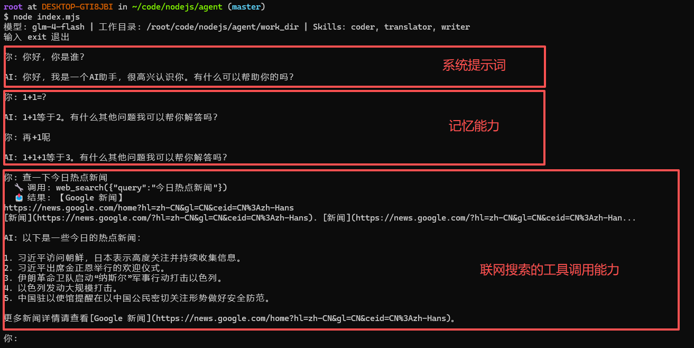

# AI Agent 开发学习总结

基于 [simple-agent](../) 项目的学习笔记，梳理 Agent 开发的核心特点与实现方式。

---

## 1. 什么是 AI Agent

### Agent 与 ChatBot 的区别

普通 ChatBot 的工作方式是 **"你说我答"**：用户提问，模型生成文字回复，结束。模型只能"说话"，不能"做事"。

AI Agent 的核心进化在于 —— **模型不仅能说话，还能行动**。当模型判断需要读取文件、搜索网页、执行代码时，它会主动调用工具（Tool），拿到结果后继续推理，直到完成任务。

```
ChatBot:  用户 → 模型 → 文字回复（结束）
Agent:    用户 → 模型 → 调用工具 → 拿到结果 → 继续推理 → ... → 文字回复（结束）
```

### Agent 的核心循环

Agent 的运行过程可以概括为一个循环：

```
感知（接收用户输入）
  → 推理（模型决定下一步做什么）
  → 行动（调用工具 / 生成回复）
  → 观察（获取工具返回结果）
  → 再次推理...
```

这就是经典的 **ReAct（Reasoning + Acting）模式**。

---

## 2. Agent 开发的核心特点

### 2.1 多轮工具调用循环

这是 Agent 最本质的特征。模型可能需要连续调用多个工具才能完成一个任务。

例如用户说"帮我查一下今天的天气并写入文件"，模型需要：
1. 调用 `web_search` 查天气
2. 调用 `write_file` 写入文件
3. 回复用户

项目中的实现（`index.mjs`）：

```javascript
// 主循环：用户输入后，进入工具调用子循环
while (true) {
  const data = await chat(messages);
  const firstChoice = data.choices[0];
  const msg = firstChoice.message;
  messages.push(msg);

  // stop = 模型认为任务完成，可以回复用户了
  if (firstChoice.finish_reason === "stop") {
    console.log(`\nAI: ${msg.content}\n`);
    break;
  }

  // tool_calls = 模型要调用工具，执行后继续循环
  if (firstChoice.finish_reason === "tool_calls") {
    for (const tc of msg.tool_calls) {
      const args = JSON.parse(tc.function.arguments);
      let result;
      try {
        result = await executeTool(tc.function.name, args);
      } catch (e) {
        result = `错误: ${e.message}`;
      }
      messages.push({ role: "tool", tool_call_id: tc.id, content: result });
    }
  }
  // 循环回到顶部，把工具结果发给模型，让模型决定下一步
}
```

**要点**：这不是简单的"调一次工具就结束"，而是一个 `while(true)` 循环，模型可以连续调用任意多次工具。循环退出的唯一条件是模型返回 `finish_reason === "stop"`。

### 2.2 函数调用（Function Calling / Tool Use）

模型本身不能直接操作文件系统或网络，它只能输出文本。**函数调用机制**让模型能"告诉"程序它想调用什么工具、传什么参数。

#### 工具定义

使用 JSON Schema 描述每个工具的名称、描述和参数：

```javascript
const tools = [
  {
    type: "function",
    function: {
      name: "write_file",
      description: "写入文件内容，不存在则创建",
      parameters: {
        type: "object",
        properties: {
          path: { type: "string", description: "文件路径" },
          content: { type: "string", description: "文件内容" },
        },
        required: ["path", "content"],
      },
    },
  },
  // ... 其他工具
];
```

**要点**：
- `description` 非常重要 —— 模型靠它理解工具的用途，决定何时调用
- `parameters` 使用 JSON Schema 格式，模型据此生成合法的参数 JSON
- `required` 告诉模型哪些参数是必须的

#### 工具执行调度

收到模型的工具调用请求后，需要一个调度器执行对应工具：

```javascript
async function executeTool(name, args) {
  switch (name) {
    case "list_files": { /* ... */ }
    case "read_file":  { /* ... */ }
    case "write_file": { /* ... */ }
    case "delete_file": { /* ... */ }
    case "web_search":  { /* ... */ }
    case "activate_skill": { /* ... */ }
    default:
      return `未知工具: ${name}`;
  }
}
```

**要点**：
- 统一的错误处理 —— 工具执行出错时不中断循环，而是把错误信息作为结果返回给模型
- 模型收到错误后可以自我纠正（比如换个参数重试）

### 2.3 消息历史管理

Agent 需要维护完整的对话上下文，包括三种角色的消息：

```
system  → 系统提示词（定义 Agent 的行为）
user    → 用户输入
assistant → 模型的回复或工具调用请求
tool    → 工具执行结果（带 tool_call_id 关联到具体的调用）
```

```javascript
const messages = [
  { role: "system", content: systemContent },
  { role: "user", content: "帮我查天气" },
  { role: "assistant", tool_calls: [{ function: { name: "web_search", arguments: '{"query":"今天天气"}' }, id: "call_xxx" }] },
  { role: "tool", tool_call_id: "call_xxx", content: "北京今天晴，25°C..." },
  { role: "assistant", content: "北京今天天气晴朗，气温25°C。" },
];
```

**要点**：
- 每轮对话把完整的 `messages` 数组发送给 API —— 模型需要看到完整历史才能做正确决策
- `tool` 消息的 `tool_call_id` 必须与 `assistant` 消息中的 `tool_calls[].id` 对应，这样模型才知道哪个结果是哪个调用的
- 随着对话增长，需要考虑 token 限制（本项目暂未处理）

### 2.4 沙盒安全机制

Agent 能操作文件系统是一个强大但危险的能力。必须做安全隔离，防止模型误操作破坏系统。

```javascript
const WORK_DIR = resolve(process.env.WORK_DIR || process.cwd());

function safePath(p) {
  const abs = resolve(WORK_DIR, p);
  if (!abs.startsWith(WORK_DIR)) throw new Error(`无权访问: ${p}`);
  return abs;
}
```

所有文件操作都经过 `safePath()` 处理：
- 先把用户提供的相对路径解析为绝对路径
- 检查绝对路径是否在 `WORK_DIR` 范围内
- 拒绝 `../../etc/passwd` 这类路径遍历攻击

**要点**：这是 Agent 安全的基本原则 —— **永远不要让模型直接操作真实文件系统，而是在受限的沙盒中操作**。

### 2.5 Skill 系统（能力模块化）

Skill 系统让 Agent 的能力可以插件化扩展，无需修改核心代码。

#### Skill 文件格式

Skill 是 Markdown 文件，包含 YAML frontmatter 和 prompt 正文：

```markdown
---
name: translator
description: 专业翻译专家，支持中英日韩等多种语言互译
keywords: 翻译,translate,英文,中文
---

你现在是专业翻译专家模式。请严格遵循以下规则：
1. 自动识别输入文本的语言
2. ...
```

#### 加载流程

```javascript
// 1. 启动时扫描 skills/ 目录
function loadSkills() {
  return readdirSync(SKILLS_DIR)
    .filter((f) => f.endsWith(".md"))
    .map((f) => {
      const raw = readFileSync(join(SKILLS_DIR, f), "utf-8");
      // 解析 frontmatter（---包裹的YAML）和正文
      const match = raw.match(/^---\n([\s\S]*?)\n---\n([\s\S]*)$/);
      // 返回 { name, description, keywords, prompt }
    })
    .filter(Boolean);
}

// 2. 将 skill 目录信息注入系统 prompt
function buildSkillCatalog() {
  const items = skills.map(
    (s) => `- ${s.name}: ${s.description} (关键词: ${s.keywords.join(", ")})`
  );
  return "## 可用 Skills\n" + items.join("\n");
}
```

**要点**：
- Skill 不是代码，而是 **prompt 模板** —— 通过注入到系统消息来改变模型行为
- 新增 Skill 只需在 `skills/` 目录添加一个 `.md` 文件，无需改代码
- 这种"用 prompt 扩展能力"的方式是 Agent 开发中非常常见的模式

### 2.6 动态 System Prompt

Agent 的系统提示词不是固定的，而是每轮对话动态构建：

```javascript
// 基础系统 prompt + skill 目录 + 当前激活的 skill
let activeSkillPrompt = "";

// 每轮对话重建系统消息
const dynamicSystem = systemContent + activeSkillPrompt;
messages[0] = { role: "system", content: dynamicSystem };
```

当用户触发某个 Skill 时，该 Skill 的完整 prompt 被注入到系统消息中：

```javascript
case "activate_skill": {
  const skill = skills.find((s) => s.name === args.name);
  activeSkillPrompt = `\n\n## 当前激活的 Skill: ${skill.name}\n${skill.prompt}`;
  return `已激活 skill "${skill.name}"，请按照该 skill 的指令来回答用户。`;
}
```

**要点**：
- 动态 prompt 让 Agent 可以根据上下文切换"角色"或"模式"
- 每轮新用户输入时重置 `activeSkillPrompt`，避免 skill 状态在多轮对话间泄漏

---

## 3. API 调用模式

本项目使用智谱AI的 OpenAI 兼容接口，请求格式如下：

```javascript
const res = await fetch(API_URL, {
  method: "POST",
  headers: {
    "Content-Type": "application/json",
    Authorization: `Bearer ${API_KEY}`,
  },
  body: JSON.stringify({
    model: MODEL,           // 模型名称
    messages: messages,     // 完整对话历史
    tools: tools,           // 可用工具列表
  }),
});
```

响应中的关键字段：

```javascript
const data = await res.json();
const choice = data.choices[0];

choice.finish_reason  // "stop" = 回复完成 | "tool_calls" = 要调用工具
choice.message.content        // 模型的文字回复（finish_reason 为 stop 时）
choice.message.tool_calls     // 工具调用请求列表（finish_reason 为 tool_calls 时）
```

**要点**：
- `tools` 参数在每次请求中都发送 —— 模型需要看到可用工具才能决定调用哪个
- 这种模式是行业标准，OpenAI、智谱、通义千问等主流 API 都支持

---

## 4. 实现架构总览

```
┌─────────────────────────────────────────────────┐
│                    Agent 主循环                    │
│                                                   │
│  用户输入                                         │
│    │                                              │
│    ▼                                              │
│  构建消息（system + 历史 + 当前输入）                │
│    │                                              │
│    ▼                                              │
│  调用 LLM API ◄─────────────────────┐             │
│    │                                 │             │
│    ├─ stop? → 输出回复，等待下一轮     │             │
│    │                                 │             │
│    └─ tool_calls?                    │             │
│         │                            │             │
│         ▼                            │             │
│    ┌─────────────┐                   │             │
│    │  工具执行器   │                   │             │
│    │             │                    │             │
│    │ list_files  │                    │             │
│    │ read_file   │                    │             │
│    │ write_file  │                    │             │
│    │ delete_file │                    │             │
│    │ web_search  │                    │             │
│    │ activate_skill                  │             │
│    └─────────────┘                    │             │
│         │                            │             │
│         ▼                            │             │
│    结果加入消息历史 ───────────────────┘             │
│                                                    │
└────────────────────────────────────────────────────┘
```

---

## 5. 学习要点总结

### Agent 开发的核心思想

| 概念 | 说明 |
|------|------|
| **工具调用循环** | Agent 不是"一问一答"，而是"循环推理+行动"直到任务完成 |
| **模型做决策** | 工具的选择和参数由模型决定，程序只负责执行 |
| **消息即上下文** | 完整的对话历史（包括工具调用和结果）是模型的"记忆" |
| **Prompt 即能力** | 通过修改系统提示词可以改变 Agent 的行为模式 |
| **沙盒隔离** | Agent 的文件操作必须在受限环境中进行 |

### 从本项目可以延伸的学习方向

1. **多 Agent 协作** — 多个 Agent 分工合作，如"规划 Agent + 执行 Agent"
2. **记忆系统** — 长期记忆（向量数据库）和短期记忆（对话历史）的管理
3. **流式输出** — 支持逐字输出，提升用户体验
4. **Token 管理** — 对话过长时自动截断或摘要，避免超出上下文限制
5. **多模态** — 支持图片、文件上传等输入方式
6. **RAG（检索增强生成）** — 让 Agent 能查询企业知识库后再回答
7. **Agent 框架** — 了解 LangChain、AutoGPT、CrewAI 等框架的设计理念



